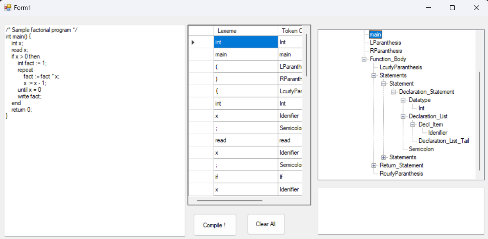
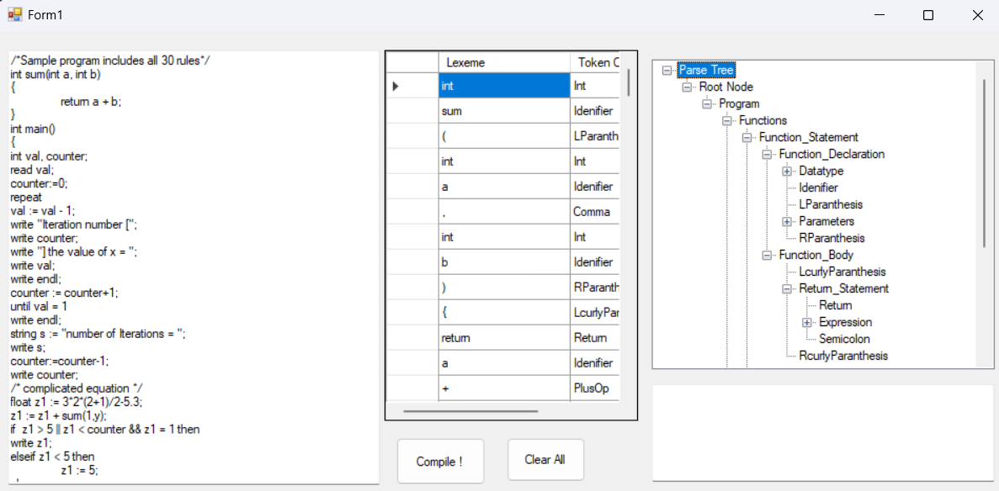
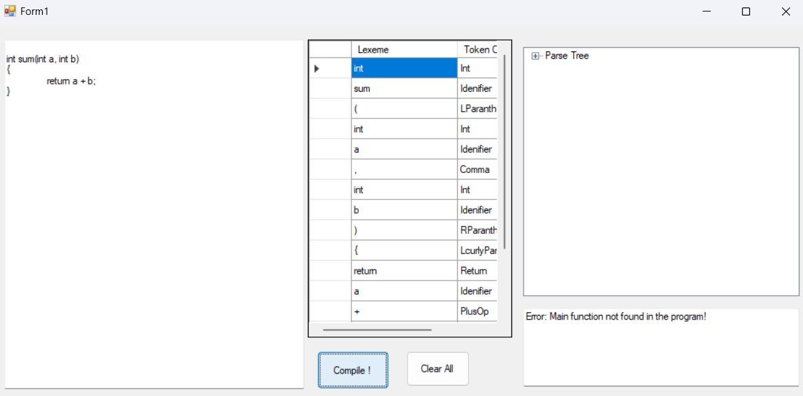
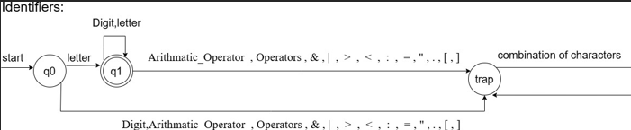
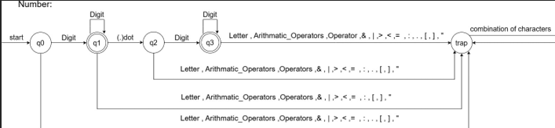
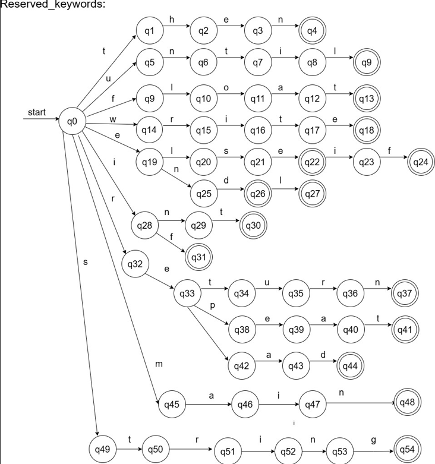

# Tiny Programming Language Compiler ⚙️🖥️
This repository contains a recursive descent parser and scanner for the TINY programming language, implemented in C#. The project focuses on lexical and syntax analysis, offering a structured foundation for building a complete compiler for the TINY language.

## Table of Contents
- [Features](#features)
- [Sample Code](#example-code)
- [Grammar Rules](#grammar-rules)
- [Installation and Setup](#installation-and-setup)
- [Known Limitations](#known-limitations)

## Features 🚀

1- [**Lexical Analysis**](./JASON_Compiler/Scanner.cs): Tokenizer (*scanner*) processes input code to extract tokens like identifiers, keywords, operators, and literals.

2- [**Syntax Analysis**](./JASON_Compiler/Parser.cs) : *Parser* validates code syntax based on Context-Free Grammar (CFG).

3- **Error Handling** 🛠️: Basic error detection and recovery to handle invalid syntax.

# [The TINY Language Overview](./Language-Description.md) 📄

**TINY** is a simple programming language with:

Functions: Programs consist of multiple functions ending with a ```main``` function.

Statements:```Declaration```, ```assignment```, ```I/O (read, write)```, ```conditionals (if, elseif, else)```, ```loops (repeat, until)```, and ```comments```.

Data Types: ```int```, ```float```, and ```string```.

Operators: ```Arithmetic (+, -, *, /)```, ```relational (<, >, =, <>)```, and ```boolean (&&, ||)```.

> For Further Details: Click [here](./Language-Description.md)

# Example Code
```csharp
/* Sample program in Tiny language – 
computes factorial*/
int main()
{
    int x;
    read x; /*input an integer*/
    if x > 0 then /*don't compute if x <= 0 */
        int fact := 1;
        repeat
            fact := fact * x;
            x := x - 1;
        until x = 0
        write fact; /*output factorial of x*/
    end
    return 0;
}
```

# Sample Run

1) 

    Example output for the factorial program:
```
/* Sample factorial program */
int main() {
    int x;
    read x;
    if x > 0 then
        int fact := 1;
        repeat
            fact := fact * x;
            x := x - 1;
        until x = 0
        write fact;
    end
    return 0;
}

Valid TINY program!
```
2)  

    Example output for the factorial program:
```
/*Sample program includes all 30 rules*/
int sum(int a, int b)
{
	return a + b;
}
int main()
{
int val, counter;
read val;
counter:=0;                                                                                
repeat                                                                                
val := val - 1;
write "Iteration number [";
write counter;
write "] the value of x = ";
write val;
write endl;                          
counter := counter+1;                                                      
until val = 1                                                                                  
write endl;                                                                                
string s := "number of Iterations = ";
write s;                                                                                
counter:=counter-1;
write counter;
/* complicated equation */    
float z1 := 3*2*(2+1)/2-5.3;
z1 := z1 + sum(1,y);
if  z1 > 5 || z1 < counter && z1 = 1 then 
write z1;
elseif z1 < 5 then
	z1 := 5;
else
         z1 := counter;
end
return 0;
}

Valid TINY program!
```
3) 

    Example output for the factorial program:
```
int sum(int a, int b)
{
	return a + b;
}

    
output:

Error: Main function not found in the program! 

Invalid TINY program!
```
# Language Grammar Examples

## DFA Examples
Here are some sample DFAs used in the lexical analyzer:

### Identifier DFA


### Number DFA


### Number DFA


## Grammar Rules

### Function Declaration
```
Function_Statement → Function_Declaration Function_Body
Function_Declaration → Datatype FunctionName (Parameters)
Parameters → Parameter Parameters_Tail | ε
Parameter → Datatype identifier
```

### Expression Grammar
```
Expression → String | Equation | Term
Equation → Term Equation_Tail
Term → Factor Term_Tail
Factor → number | identifier | Function_Call | (Equation)
```

> You can See More Detailed Grammar, and DFA through their Documentation [MS1](./Docs/compiler%20MS1%20.pdf), [MS2](./Docs/compiler%20MS2.pdf)
# Files

1- [Parser.cs](./JASON_Compiler/Parser.cs) - Implements recursive descent parsing.

2- [Scanner.cs](./JASON_Compiler/Scanner.cs) - Implements lexical analysis.

3- [Test Cases](./Test%20Cases/) - Contains sample programs for testing.

4- [Docs](./Docs/) 📄 - Includes Two Files:
   - [MS1](./Docs/compiler%20MS1%20.pdf) - Contains The Regular Expressions for Tokens, and DFAs rules of Tokens
   - [MS2](./Docs/compiler%20MS2.pdf) - Contains The ***CFG*** "Context Free Grammar" which is the Production Rules of the grammar and detailed specifications about terminals.

# Requirements 📚

## **Software Requirements:** 💻

*   
  Ensure you have the latest version of the .NET Framework/SDK installed.

* 
    or any C# compatible environment.  
    It's recommended to use Visual Studio for its integrated features.
> **Note:** Make sure to configure your IDE for C# development.

# Installation and Setup

1. Clone this repository:
```bash
git clone https://github.com/MoDevil/TinyCompiler.git
```

2. Open Visual Studio
3. Navigate to File → Open → Project/Solution
4. Browse to the cloned repository and select the solution file
5. Build the solution (Ctrl + Shift + B)
6. Run the project (F5)

# Usage

1. Run the application
2. Enter your TINY code in the input area
3. Click "Compile" 
4. View the lexical and syntax analysis results

# Troubleshooting

Common issues and solutions:

1. **Build Errors**
   - Ensure .NET Framework is properly installed
   - Clean solution and rebuild


# Contributing

1. Fork the repository
2. Create a new branch (`git checkout -b feature/improvement`)
3. Make changes and commit (`git commit -am 'Add new feature'`)
4. Push to the branch (`git push origin feature/improvement`)
5. Create a Pull Request

## Coding Standards
- Follow C# naming conventions
- Add comments for complex logic


# Known Limitations

1. Error Recovery
   - Basic error recovery implementation

2. GUI
    - simple GUI implementation


